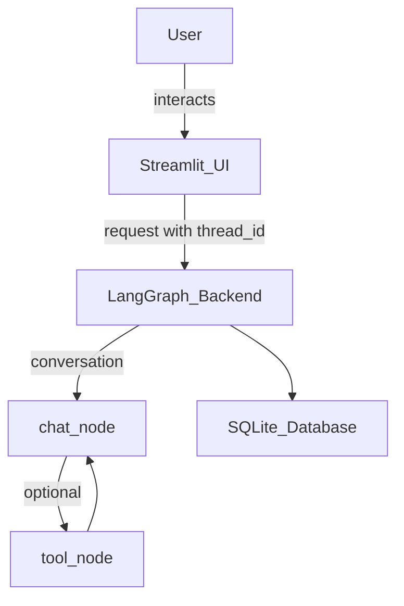

# 🌟 LangGraph Chatbot (Streamlit + SQLite + Gemini Tools)

A modern AI-powered chatbot built with **LangGraph**, **Google Gemini**, **Streamlit**, and **SQLite**.  
Supports persistent multi-thread conversations with tool usage, dialog popups, and streaming responses — simple, extensible, and production-ready!

---

---

## 📌 Features

### 💬 Multi-Thread Chat System
- Unlimited chat threads
- Persistent storage using SQLite
- Instant restoration of conversations
- Auto-generated short titles

### 🧠 LangGraph Stateful Conversation Engine
- Custom workflow:  
  `START → chat_node → (tools?) → chat_node → END`
- Automatic message persistence
- State restored via SQLite checkpoints
- Tool routing based on LLM logic

### 🔧 Built-in Tools

| Tool                 | Purpose                |
|----------------------|------------------------|
| 🔍 DuckDuckGo Search | Real-time search       |
| ➗ Calculator        | Math operations        |
| 📈 Stock API         | Live stock prices      |

### 🎨 Modern Streamlit UI
- Smooth streaming responses
- Tool-activity status indicator
- Clean UI (ToolMessages hidden in history)
- Popup dialogs for Rename & Delete
- Arrow indicator for active thread

### 🤖 Dual-LLM Architecture
- **Gemini 2.5 Flash:** Main conversation model
- **Gemini 2.0 Flash:** Lightweight auto-title generator _(avoids rate-limits)_

### 🛠️ Tech Stack
- **Frontend:** Streamlit
- **Backend:** LangGraph + LangChain
- **LLM:** Google Gemini Flash
- **Tools:** Search, Calculator, Stock API
- **Database:** SQLite
- **State Management:** LangGraph Checkpointer

---

## 🏗️ Architecture Overview



- **User**
    - ↓
- **Streamlit UI (frontend)**
    - ↓ request with thread_id
- **LangGraph Backend (chatbot)**
    - `chat_node → tool_node → chat_node`
    - ↓
- **SQLite Database (persistent)**

---

## 📁 Project Structure

```
project/
│── frontend_latest.py     # Streamlit UI
│── backend_latest.py      # LangGraph backend engine
│── requirements.txt       # Dependencies
│── chatbot.db             # SQLite conversation storage
│── chat_titles.json       # Local title cache
│── .env                   # API keys (Gemini, Stock API)
│── README.md              # This file
```

---

## ⚙️ Installation

1. **Clone repo**
    ```bash
    git clone https://github.com/AnishShaw1/langgraph-projects
    cd langgraph-projects
    ```
2. **Create virtual environment**
    ```bash
    python -m venv env
    # Windows
    env\Scripts\activate
    # Mac/Linux
    source env/bin/activate
    ```
3. **Install dependencies**
    ```bash
    pip install -r requirements.txt
    ```
4. **Add .env file**
    ```
    GEMINI_API_KEY=your_key
    ALPHAVANTAGE_API_KEY=your_key
    ```
5. **Run app**
    ```bash
    streamlit run frontend_latest.py
    ```

---

## 🗃️ Database Details (SQLite)

LangGraph automatically generates:

### 1. `checkpoints` table
- Stores:
    - message history
    - state metadata
    - transitions

### 2. `writes` table
- Stores:
    - tool results
    - tool execution logs

#### Chat Identification
- Each chat: `thread_id = UUID`

---

## ⚠️ Limitations

1. **SQLite Scaling Limits**
    - Good for local/single-user
    - Not suitable for:
        - high traffic
        - many users
        - concurrent writes
    - _Production recommendation: PostgreSQL + PGVector or ChromaDB._

2. **No User Authentication**
    - Single-user only
    - Public deployment: All users see the same threads
    - _Multi-user: Use FastAPI + JWT + DB._

3. **No RAG (Retrieval-Augmented Generation)**
    - Missing:
        - PDF upload
        - text chunking
        - embeddings
        - vector search
    - _Solution: Add FAISS/Chroma + LangGraph retrieval node._

4. **Gemini Free-Tier Rate Limits**
    - 10 requests/min
    - Search tool increases usage
    - Using second model (`llm1`) reduces title-generation pressure

5. **Streamlit is not a backend**
    - Cannot handle:
        - authentication
        - multi-user concurrency
        - secure APIs
    - _Recommended: Use Streamlit only as UI for production._

---

## 🚀 Future Improvements

| Improvement                | Description                                      |
|----------------------------|--------------------------------------------------|
| 🌟 Multi-User Accounts     | FastAPI backend,<br>JWT login,<br>per-user threads,<br>secure roles |
| 🌟 Add RAG Workflow        | PDF upload,<br>embeddings,<br>vector search,<br>LangGraph retrieval |
| 🌟 Migrate to PostgreSQL   | Large datasets,<br>concurrency,<br>multi-user platforms|
| 🌟 Enhanced Tool UI        | Dedicated tool output cards,<br>search visualization|
| 🌟 Cloud Deployment        | Backend: FastAPI(Railway/Render)<br>DB: PostgreSQL/Neon<br>Frontend: Streamlit Cloud<br>File Storage: Supabase|

---

## ⭐ Final Notes

This project is a complete example of combining:

- ✔ **LangGraph**
- ✔ **Gemini Flash**
- ✔ **LangChain Tools**
- ✔ **SQLite persistence**
- ✔ **Streamlit UI**

_into a clean, functional, ChatGPT-like chatbot with tool support._
